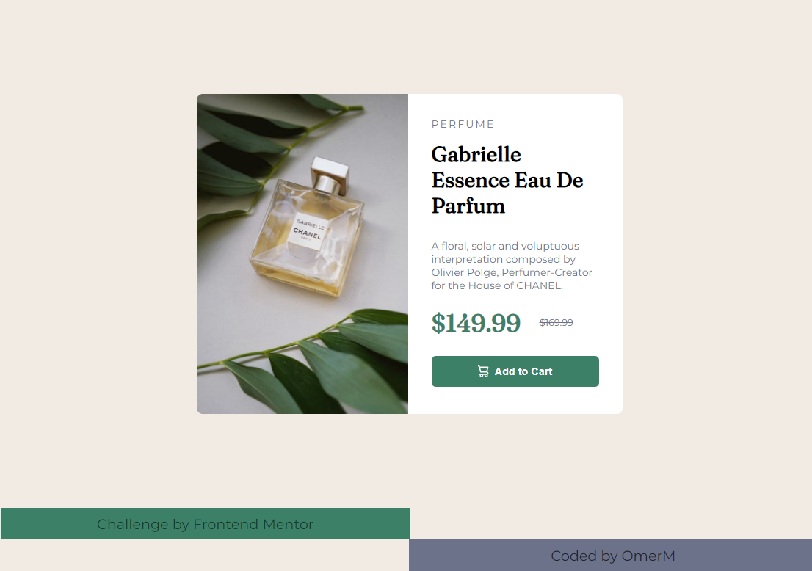

# Frontend Mentor - Product preview card component

<h5>Assalam U Alaikum, well I don't like writing descriptions but Readme is fine</h5>
<hr>

## Table of contents

- [Overview](#overview)
  - [The challenge](#the-challenge)
  - [Snapshots](#snapshots)
- [My process](#my-process)
  - [What I learned](#what-i-learned)
  - [Useful resources](#useful-resources)
  - [Thoughts](#thoughts)
- [Author](#author)

## Overview

### The challenge

Users should be able to:

- View the optimal layout depending on their device's screen size
- See hover and focus states for interactive elements

### Snapshots




## My process

### What I learned

I already knew about how to do <strike><del>this</del></strike> but forgot about it so by researching I got to know about the <strong>strike</strong> tag it's a fallback as <strong>del</strong> isn't visible in every browser

```html
<p class="old-price">
  <strike>
    <del>$169.99</del>
  </strike>
</p>
```

This was the code that finally like damn finally worked and the mobile version was good and happy :D

```css
.box {
  max-width: 375px;
  margin: 1em auto;
  display: block;
}
```

I'm damn glad to learn how to add code snippets!!!

```html
  ```html <p>Your Code</p> ```
```

### Useful resources

[How to take a screenshot?](https://www.makeuseof.com/how-to-full-page-screenshot-chrome-firefox/) - I didn't knew how to take a webpage snapshot so yeah

### Thoughts

It was easy but still there were some places where I got stuck (centering & responsiveness) so this helped me narrow down some of my weak points and also forced me to try different ways to style things. Making mobile friendly websites are kinda difficult but I'll be glad to continue doing it

## Author

- Twitter - [@MaskeyDude](https://www.twitter.com/MaskeyDude)
- Frontend Mentor - [@MaskeyDude](https://www.frontendmentor.io/profile/MaskeyDude)

<hr>
<div align="center">
<a href="">Preview</a>
</div>
